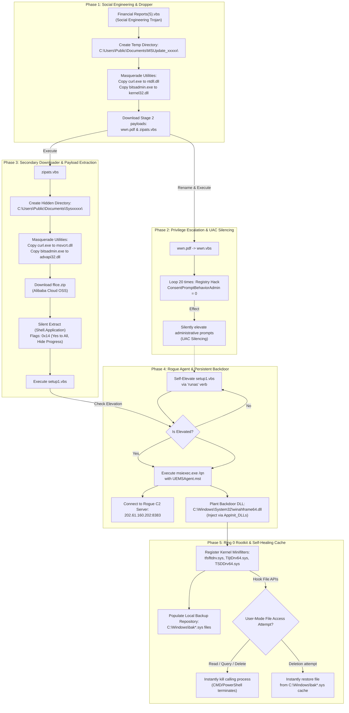

# Threat Intel Bulletin: Multi-Stage Malicious Dropper & Self-Healing Kernel Rootkit Campaign

**Document Reference:** TR-2026-0613-A  
**Classification:** Public Threat Intelligence / Threat Research Report  
**Target OS:** Windows Enterprise Endpoints  
**Threat Actor Profile:** Sophisticated Persistent Threat / Rogue RMM Deployer  
**Status:** Under Analysis  

---

## Executive Summary

On June 9, 2026, an enterprise Windows endpoint was subjected to an advanced multi-stage cyber attack. The intrusion initiated via a social-engineering dropper masquerading as a financial spreadsheet (`Financial Reports(S).vbs`). Over the course of the execution chain, the campaign systematically dismantled system-level defenses (User Account Control prompting), deployed an enterprise-grade commercial remote management tool as a backdoor (BYOAgent / Rogue RMM), and anchored itself in the OS kernel.

Persistence and anti-tamper capabilities were maintained via **Ring 0 kernel-level minifilter drivers** paired with a hidden, offline **self-healing backup cache repository** in `C:\Windows\`. Any administrative utility (PowerShell, CMD, or Windows Explorer) attempting to query, inspect, or delete the malicious files was instantly killed by kernel-mode hooks. This report details the technical dissection of the malware's delivery vector, evasion mechanics, and component architecture.

---

## 1. Attack Lifecycle & Rootkit Chain

The attack lifecycle progresses across five distinct execution phases:

---

## 2. Kernel-Level Defense Mechanisms & Self-Healing

The threat kit achieves visual and operational self-defense on a live-booted system through two tightly integrated kernel-level systems:

### A. Ring 0 Anti-Tampering Minifilter Drivers
The attacker registered multiple kernel-level drivers under `C:\Windows\System32\drivers\`:
* **`tfsfltdrv.sys`** (Threat File System Filter Driver)
* **`TIjtDrv64.sys`**
* **`TSDDrv64.sys`**

These drivers register as filesystem minifilter drivers. At the Ring 0 level, they hook essential I/O Request Packets (IRPs) relating to file query, open, and deletion requests.
* **The Thread-Killing Hook:** If any user-mode thread or API (such as an administrative PowerShell console, a Command Prompt session, or Windows Explorer) attempts to run filesystem queries on the protected malware directories (e.g., calling `Test-Path`, `Get-ChildItem`, or `Remove-Item` on `C:\Program Files\DesktopCentral_Agent` or `C:\Users\Public\Documents\Sys*`), the driver intercepts the request. Rather than returning an "Access Denied" error, the kernel driver immediately **terminates the calling process**, crashing the shell window instantly.
* **The Registry Loophole:** Crucially, these minifilters **only hook file-system operations**. They do not monitor or restrict registry writes, allowing registry operations to proceed unhindered.

### B. The Hidden Self-Healing Repository
The root directory `C:\Windows\` is populated with hundreds of files disguised as system backups:
* `bakahframe64.sys`, `bakahframe32.sys` (backups for `winahframe64.dll`/`winahframe32.dll`)
* `bak32msm.sys`, `bak32msc.sys`
* `bakDocTraverser64.sys`, `bakDocTraverser32.sys`

These are actually **renamed copies of malicious payload DLLs and EXEs**. If an offline tool or an early-boot script manages to delete an active backdoor file (like `winahframe64.dll`), the filesystem driver intercepts the next access or boot event and copies the file from its corresponding `bak*.sys` counterpart back into `System32\`. This guarantees persistence even if user-space files are partially deleted.

---

## 3. Component Deep Dive

### Component A: `wwn.pdf` (UAC Bypass & Silencing Utility)
* **Source:** `http://temu.baskwms.top/wwn.pdf`
* **Size:** 1,122 Bytes
* **Nature:** Disguised as a PDF file; actually a raw VBScript.
* **Function:** 
  Uses the `ShellExecute` method with the `"runas"` verb to trigger an elevated prompt. It executes a loop 20 times (sleeping `470ms` between iterations) that writes a critical value to the Windows Registry:
  * **Path:** `HKLM\SOFTWARE\Microsoft\Windows\CurrentVersion\Policies\System`
  * **Key:** `ConsentPromptBehaviorAdmin`
  * **Target Value:** `0` (REG_DWORD)
  
> [!IMPORTANT]
> **Registry Impact:**  
> Setting `ConsentPromptBehaviorAdmin` to `0` configures Windows User Account Control to **elevate administrative requests silently** without displaying any prompt on the secure desktop. This enables subsequent stages of the malware to silently gain full Administrator privileges without the user's knowledge.

### Component B: `zipats.vbs` (Payload Downloader & Silent Extractor)
* **Source:** `https://shaaslong.one/cawua/zipats.vbs`
* **Size:** 5,510 Bytes
* **Evasion & Extraction Logic:**
  * **Obfuscation:** Uses string splitting (e.g., `s_curl = "c" & "ur" & "l"`) to bypass static signature scanners.
  * **Folder Masquerading:** Creates a hidden system directory `C:\Users\Public\Documents\Sys<random_number>\` (Attribute `3`). It copies `curl.exe` to `msvcrt.dll` and `bitsadmin.exe` to `advapi32.dll` to evade command auditing.
  * **Timing Delays:** Implements randomized sleeps between 1.5 and 5 seconds to bypass behavioral sandboxes.
  * **Unzipping:** Downloads `ffice.zip` from Alibaba Cloud (OSS) Singapore (`https://baolongwes.oss-ap-southeast-1.aliyuncs.com/ffice.zip`) and extracts it silently using Windows Shell objects with copy flag `&H14` (`4` - suppress progress bar + `16` - automatic "Yes to All" overwrites).

### Component C: `setup1.vbs` (Silent RMM Agent Installer)
* **Extracted From:** `ffice.zip`
* **Objective:**
  * Uses `runas` to ensure full elevation.
  * Launches `msiexec.exe /qn` to silently install `UEMSAgent.msi` (ManageEngine Endpoint Central Agent) utilizing a custom transform file (`UEMSAgent.mst`) and custom security certificates. The `/qn` switch completely suppresses any user interface, completing the installation in the background.

### Component D: `winahframe64.dll` (Custom Persistent Backdoor)
* **Target Location:** `C:\Windows\System32\winahframe64.dll`
* **Evasion & Load Logic:**
  * Serves as a persistent fail-safe backdoor. If the Endpoint Central agent is uninstalled, this DLL remains.
  * Registered in the Windows `AppInit_DLLs` registry keys:
    * `HKLM\SOFTWARE\Microsoft\Windows NT\CurrentVersion\Windows -> AppInit_DLLs`
    * This configuration instructs the Windows Subsystem (`csrss.exe`/`user32.dll`) to load this custom DLL into **every single user-mode process** that spawns on the system, providing a global process injection hook.

---

## 4. Attack Methodology: Bring Your Own Agent (BYOAgent)

This campaign prominently features the **Bring Your Own Agent (BYOAgent)** technique, also known as **Rogue RMM deployment**. Rather than deploying flaggable custom trojans, the attacker utilizes a legitimate commercial remote management software agent (Zoho ManageEngine Endpoint Central Agent) configured to communicate with the attacker's server.

### Strategic Benefits for Threat Actors:
1. **EDR/AV Trust:** The executable `UEMSAgent.msi` is a legitimate, digitally signed Zoho binary. Standard endpoint security tools treat it as a trusted application.
2. **Built-in Capabilities:** The agent provides the attacker with immediate, out-of-the-box administrative control over the target endpoint:
   * Execution of background cmd/PowerShell consoles as `NT AUTHORITY\SYSTEM`.
   * Drag-and-drop remote file transfer.
   * Visual remote control and screen capture.
   * Adjacent network scanning and lateral movement capabilities.

### Rogue Management Server Details (`DCAgentServerInfo.json`):
The configuration transform file linked the agent to the attacker's management console:
* **Command & Control (C2) Server IP:** `202.61.160.202`
* **C2 Secure Communication Port:** `8383` (Standard Endpoint Central SSL Port)
* **Flat Server Hostname:** `WIN-U48PR6FFN2E`
* **Rogue Customer/Tenant Name:** `DC_CUSTOMER` (Tenant ID `1`)
* **Agent Security Handshake Key:** `f943c8437bb6ce21ab78715959369470`

---

## 5. Indicators of Compromise (IoCs)

### File System Artifacts

| File Path / Pattern | Classification | Notes |
| :--- | :--- | :--- |
| `C:\Windows\System32\winahframe64.dll` | High (Backdoor DLL) | persistent AppInit_DLLs injection target |
| `C:\Windows\SysWOW64\winahframe64.dll` | High (Backdoor DLL) | WOW64 version of the backdoor |
| `C:\Windows\bakahframe64.sys` | High (Self-Healing Backup) | Renamed backup copy of winahframe64.dll |
| `C:\Windows\bakahframe32.sys` | High (Self-Healing Backup) | Renamed backup copy of winahframe32.dll |
| `C:\Windows\bak*.sys` | High (Self-Healing Cache) | Various malicious DLL/EXE backup copies |
| `C:\Windows\System32\drivers\tfsfltdrv.sys` | Critical (Kernel Minifilter) | Active filesystem interceptor |
| `C:\Windows\System32\drivers\TIjtDrv64.sys` | Critical (Kernel Minifilter) | Active filesystem interceptor |
| `C:\Windows\System32\drivers\TSDDrv64.sys` | Critical (Kernel Minifilter) | Active filesystem interceptor |
| `C:\Users\Public\Documents\Sys*\msvcrt.dll` | Medium (Masqueraded Tool) | Masked copy of curl.exe |
| `C:\Users\Public\Documents\Sys*\advapi32.dll` | Medium (Masqueraded Tool) | Masked copy of bitsadmin.exe |
| `C:\Users\Public\Documents\Sys*\tmp*.zip` | Medium (Payload Archive) | Compressed stage 3 package |
| `C:\Users\Public\Documents\Sys*\setup1.vbs` | Medium (Installer Script) | Script that launches silent MSI |

### Network Indicators

| Indicator / Full URL | Type | Purpose |
| :--- | :--- | :--- |
| `202.61.160.202:8383` | IPv4 Socket | Rogue Command & Control (C2) Server |
| `http://temu.baskwms.top/wwn.pdf` | HTTP URL | Host for Stage 2 dropper (`wwn.pdf`) |
| `https://shaaslong.one/cawua/zipats.vbs` | HTTPS URL | Host for Stage 2 downloader (`zipats.vbs`) |
| `https://baolongwes.oss-ap-southeast-1.aliyuncs.com/ffice.zip` | HTTPS URL | Alibaba OSS bucket hosting Stage 3 package (`ffice.zip`) |

### Registry Indicators

| Registry Path | Key | Value | Purpose |
| :--- | :--- | :--- | :--- |
| `HKLM\SOFTWARE\Microsoft\Windows NT\CurrentVersion\Windows` | `AppInit_DLLs` | `winahframe64.dll` | Forces early-stage process injection |
| `HKLM\SOFTWARE\Microsoft\Windows\CurrentVersion\Policies\System` | `ConsentPromptBehaviorAdmin` | `0` | Disables UAC administrative prompts |
| `HKLM\SYSTEM\CurrentControlSet\Services\tfsfltdrv` | `Start` | `2` (Automatic) | Startup behavior for kernel filter |
| `HKLM\SYSTEM\CurrentControlSet\Services\TIjtDrv64` | `Start` | `2` (Automatic) | Startup behavior for kernel filter |
| `HKLM\SYSTEM\CurrentControlSet\Services\TSDDrv64` | `Start` | `2` (Automatic) | Startup behavior for kernel filter |
