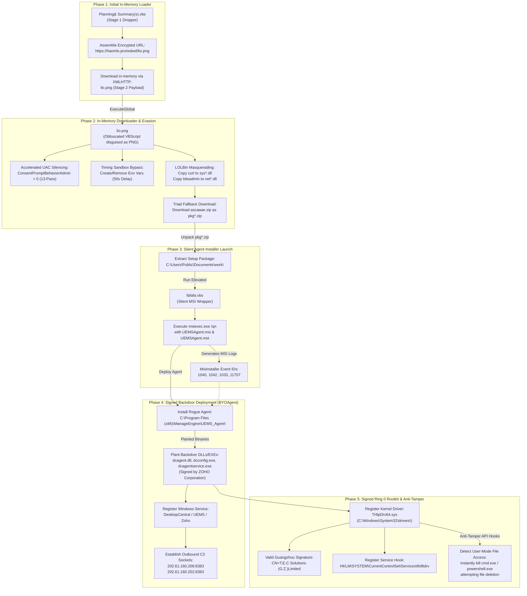

# Threat Intel Bulletin: Multi-Stage Signed Dropper, BYOAgent Persistence & Kernel Rootkit Campaign

**Document Reference:** TR-2026-0705-B  
**Classification:** Public Threat Intelligence / Threat Research Report  
**Target OS:** Windows Enterprise Endpoints  
**Threat Actor Profile:** Sophisticated Persistent Threat / Rogue RMM Deployer  
**Status:** Under Analysis  

---

## Executive Summary

On July 3, 2026, an enterprise Windows endpoint was subjected to an advanced, multi-stage cyber attack representing an evolved variant of the June campaign (TR-2026-0613-A). The intrusion initiated via a social-engineering dropper masquerading as a system administration script (`Planning& Summary(s).vbs` or `Financial Reports(s).vbs`) staged inside `C:\Users\Public\Documents\`. 

In this July 2026 variant, the threat actor implemented a significant tactical shift. Instead of relying on unsigned custom malware (such as `winahframe64.dll` and `bakahframe64.sys`), the attacker leveraged a **BYOAgent (Bring Your Own Agent)** model. This involved silently deploying a validly signed commercial remote management agent (ManageEngine UEMS Agent by Zoho Corporation) to establish a persistent administrative backdoor. Evasion and visual self-defense were achieved using a **Ring 0 kernel-level minifilter driver** (`THlpDrv64.sys`) carrying a valid cryptographic signature issued to **Guangzhou TEC Solutions (IP-guard)**, paired with active service hooks. This report details the technical dissection of this campaign's delivery vector, defense mechanisms, and component architecture.

---

## 1. Attack Lifecycle & Rootkit Chain

The execution flow of the July 2026 variant is structured across five major phases:

---

## 2. Kernel-Level Defense Mechanisms & Evasion

The July 2026 threat kit achieves visual and operational self-defense on a live-booted system through a validly signed kernel-level system:

### A. Legitimate-Signed Ring 0 Anti-Tampering Minifilter Driver
To prevent operators from discovering, stopping, or deleting the rogue agent, the actor installs a kernel-mode rootkit driver under `C:\Windows\System32\drivers\THlpDrv64.sys`:
* **Cryptographic Verification**: The driver carries a valid digital signature issued to **T.E.C Solutions (G.Z.) Limited** (the official development firm for **IP-guard** Data Loss Prevention software).
* **Anti-Tampering Hooks**: The driver registers a minifilter in the operating system. If any administrative tool (such as PowerShell or CMD) attempts to run filesystem queries, lists, or deletion operations on the protected malware directories:
  - `C:\Program Files (x86)\ManageEngine`
  - `C:\Program Files\ManageEngine`
  - `C:\Program Files (x86)\UEMS_Agent`
  - `C:\Users\Public\Documents\work`
  the driver intercepts the I/O Request Packet (IRP). Instead of blocking it with an access error, the driver **instantly terminates the calling process**, crashing the operator's console shell.
* **The Registry Loophole**: Crucially, these minifilters **only hook file-system operations**. They do not monitor or restrict registry writes, allowing registry operations to proceed unhindered. This enables disarming via offline SCM registry modification.

---

## 3. Component Deep Dive

### Component A: `Planning& Summary(s).vbs` (Stage 1 Remote VBScript Loader)
* **Source/Location**: `C:\Users\Public\Documents\Planning& Summary(s).vbs` (or `Financial Reports(s).vbs`)
* **Size**: 6,255 Bytes
* **Nature**: Obfuscated VBScript loader (Version 29.0).
* **Function**: Serves as the initial entry point. Upon user execution, it decodes and composes the remote payload URL from an encrypted array fragment: `https://haomls.pro/wdwd/lio.png`. It downloads the content of `lio.png` in-memory using `MSXML2.XMLHTTP` and executes it directly via `ExecuteGlobal`. It incorporates multiple redundant padding modules (`SegmentA` through `SegmentE`) to inflate size, obfuscate structure, and bypass static analysis.

### Component B: `lio.png` (Stage 2 UAC Silencing & Payload Downloader - Masqueraded as PNG)
* **Source/Location**: `https://haomls.pro/wdwd/lio.png`
* **Size**: 6,432 Bytes (6.3 KB)
* **Nature**: Obfuscated Stage 2 VBScript Downloader, disguised as a PNG file.
* **Function**: Executes directly in memory via `ExecuteGlobal` after an in-memory HTTP GET fetch. It performs the following sequence:
  1. **UAC Silencing Bypass**: Executes an accelerated 13-pass privilege elevation loop (sleeping `393ms` between iterations) that runs a silent command to write a registry policy bypass:
     - **Path:** `HKLM\Software\Microsoft\Windows\CurrentVersion\Policies\System`
     - **Key:** `ConsentPromptBehaviorAdmin`
     - **Target Value:** `0` (REG_DWORD, silences elevation prompt dialogs).
     It invokes this via `Shell.Application` using the `"runas"` elevation verb.
  2. **Active Timing Delay Loop**: Executes an environment-based sandbox bypass loop 10 times with 5-second sleeps (`WScript.Sleep 5000`). It generates noise by writing and immediately removing process environment variables `D_1` through `D_10` with randomized hex seeds (e.g. `"0x" & Hex(Int(Rnd() * 65535))`), successfully stalling execution for 50 seconds to evade real-time EDR analysis windows.
  3. **String/Object Decryption**: Employs an ASCII array character conversion function `D(arr)` to obfuscate key keywords and native shell objects from static scanners:
     - `"wscript"` is decoded from `Array(119, 115, 99, 114, 105, 112, 116)`
     - `"curl"` is decoded from `Array(99, 117, 114, 108)`
     - `"bitsadmin"` is decoded from `Array(98, 105, 116, 115, 97, 100, 109, 105, 110)`
     - `"certutil"` is decoded from `Array(99, 101, 114, 116, 117, 116, 105, 108)`
     - Stage 3 payload URL `https://haomls.pro/caiwuaaa/ascaaae.zip` is decoded from `Array(104, 116, 116, 112, 115, 58, 47, 47, 104, 97, 111, 109, 108, 115, 46, 112, 114, 111, 47, 99, 97, 105, 119, 117, 97, 97, 97, 47, 97, 115, 99, 97, 97, 97, 101, 46, 122, 105, 112)`.
  4. **LOLBin Masquerading**: Copies local system tools into `C:\Users\Public\Documents\work\` with randomized names to mask execution command paths from command-line auditing filters:
     - Copies `curl.exe` to `sys<random>.dll`
     - Copies `bitsadmin.exe` to `net<random>.dll`
     - Obscures files by setting their Attributes to `3` (Hidden + System).
  5. **Triad Downloader Fallback**: Executes a fallback download sequence over three sequential methods:
     - **Method 1:** Masqueraded Curl DLL: `sys*.dll -k -s -L -o`
     - **Method 2:** Masqueraded Bitsadmin DLL: `net*.dll /transfer`
     - **Method 3:** Decoded Certutil: `certutil -urlcache -split -f`
     Once downloaded, it verifies the archive is >1024 bytes, hides it, unzips the files into the work directory, executes the installation script `fafafa.vbs`, and silently deletes the `.zip` file from disk.

### Component C: `fafafa.vbs` (Stage 3 Silent Background Agent Installer)
* **Source/Location**: Extracted from `ascaaae.zip` into `C:\Users\Public\Documents\work\fafafa.vbs`
* **Size**: 1,592 Bytes (1.6 KB)
* **Nature**: Silent Background Installer Script (VBScript).
* **Function**: Executes the silent backend installation sequence:
  1. Resolves its parent folder and validates the presence of the installer package `UEMSAgent.msi`.
  2. If executed without elevation parameters, it spawns a self-elevated process using the `ShellExecute` method with the `"runas"` verb.
  3. Launches a background, fully silent MSI transaction:
     `msiexec.exe /i "UEMSAgent.msi" TRANSFORMS="UEMSAgent.mst" ENABLESILENT=yes REBOOT=ReallySuppress INSTALLSOURCE=Manual SERVER_ROOT_CRT="DMRootCA-Server.crt" DS_ROOT_CRT="DMRootCA.crt" /qn`
     The `/qn` argument completely disables all visual progress bars and dialogues. It returns code `0` or `3010` (reboot pending) on a successful deployment.

### Component D: `THlpDrv64.sys` (Signed Kernel Minifilter Driver)
* **Source/Location**: `C:\Windows\System32\drivers\THlpDrv64.sys`
* **Size**: ~100 KB
* **Nature**: Ring 0 device driver with a valid digital signature from `CN=T.E.C Solutions (G.Z.)Limited` (IP-guard).
* **Function**: Serves as a persistent Ring 0 rootkit. Registered as the service `tfsfltdrv`, it intercepts and blocks attempts to inspect or delete any of the campaign files or directories (e.g., `UEMS_Agent`, `ManageEngine`, or `work`), instantly killing the calling shell process.

---

## 4. Attack Methodology: Bring Your Own Agent (BYOAgent)

This campaign prominently features the **Bring Your Own Agent (BYOAgent)** technique, also known as **Rogue RMM deployment**. Rather than deploying flaggable custom trojans, the attacker utilizes a legitimate commercial remote management software agent (Zoho ManageEngine Endpoint Central Agent) configured to communicate with the attacker's server.

### Strategic Benefits for Threat Actors:
1. **EDR/AV Trust:** The executable `UEMSAgent.msi` and its dropped binaries are legitimate, digitally signed Zoho binaries. Standard endpoint security tools treat them as trusted applications.
2. **Built-in Capabilities:** The agent provides the attacker with immediate, out-of-the-box administrative control over the target endpoint:
   * Execution of background cmd/PowerShell consoles as `NT AUTHORITY\SYSTEM`.
   * Drag-and-drop remote file transfer.
   * Visual remote control and screen capture.
   * Adjacent network scanning and lateral movement capabilities.

### Rogue Management Server Details (`DCAgentServerInfo.json`):
The configuration transform file (`UEMSAgent.mst`) and embedded JSON metadata linked the agent to the attacker's management console with the following highly specific cryptographic and connectivity parameters:
* **Primary Command & Control (C2) Server IP:** `202.61.160.208`
* **Backup Command & Control (C2) Server IP:** `202.61.160.202`
* **C2 Secure Communication Port:** `8383` (Standard Endpoint Central SSL Port)
* **Adversary Infrastructure Domain:** `haomls.pro`
* **Rogue Customer/Tenant Name:** `DC_CUSTOMER` (Customer ID `1`, MSP Name: `DC_MSP`)
* **Rogue Remote Office Name:** `Local Office` (Remote Office ID `1`, Branch ID `1`)
* **Rogue Remote Office Authorization Key (`REMOTEOFFICEAUTHKEY`):** `f943c8437bb6ce21ab78715959369470`
* **Registration Authentication Hash (`DSAuthProps.VALUE1`):** `11db5a8c7817fdd49405f54c3b88507cd3debcc76665cc0462fd2f2e28690ffc3978ca0271509c3b39956cea6486dab0`
* **Secondary Auth Hash/Matching Handshake Key (`DSAuthProps.VALUE2`):** `f943c8437bb6ce21ab78715959369470`
* **Server Time Token (`ServerHashTime`):** `1774903964`
* **Agent Version Profile:** `11.3.2400.33.W` (Product Code `DCEE` / `[DCEE]`)

---

## 5. Indicators of Compromise (IoCs)

### File System Artifacts

| File Path / Pattern | Classification | Notes |
| :--- | :--- | :--- |
| `C:\Users\Public\Documents\Planning& Summary(s).vbs` | Critical (VBS Dropper) | Unsigned Stage 1 dropper file |
| `C:\Users\Public\Documents\Financial Reports(s).vbs` | Critical (VBS Dropper) | Unsigned Stage 1 dropper file |
| `C:\Users\Public\Documents\work\fafafa.vbs` | Critical (Installer Script) | Stage 3 silent background setup script |
| `C:\Users\Public\Documents\work\pkg*.zip` | Critical (Payload Archive) | Extracted Stage 3 ZIP payload (`ascaaae.zip`) |
| `C:\Users\Public\Documents\work\sys*.dll` | High (Masqueraded Tool) | Masked copy of curl.exe |
| `C:\Users\Public\Documents\work\net*.dll` | High (Masqueraded Tool) | Masked copy of bitsadmin.exe |
| `C:\Users\Public\Documents\work\UEMSAgent.msi` | Critical (Silent Installer) | Legitimate Zoho-signed MSI agent |
| `C:\Users\Public\Documents\work\setup.bat` | Critical (Installer Script) | Decoy interactive script |
| `C:\Windows\System32\drivers\THlpDrv64.sys` | Critical (Kernel Minifilter) | Active rootkit driver signed by T.E.C Solutions |
| `C:\Program Files (x86)\ManageEngine\UEMS_Agent\dcagent.dll` | Critical (RMM Module) | Valid Zoho Corporation signature |
| `C:\Program Files (x86)\ManageEngine\UEMS_Agent\dcconfig.exe` | Critical (RMM Config) | Valid Zoho Corporation signature |
| `C:\Program Files (x86)\ManageEngine\UEMS_Agent\bin\dcagentservice.exe` | Critical (RMM Service) | Valid Zoho Corporation signature |
| `C:\Program Files (x86)\ManageEngine\UEMS_Agent\bin\AgentQPPMUpgrader.exe` | Critical (RMM Upgrader) | Valid Zoho Corporation signature |
| `C:\Program Files (x86)\ManageEngine\UEMS_Agent\bin\ClientAuthHandler.dll` | Critical (RMM Auth Handler) | Valid Zoho Corporation signature |
| `C:\Program Files (x86)\ManageEngine\UEMS_Agent\bin\dcagentregister.exe` | Critical (RMM Register) | Valid Zoho Corporation signature |
| `C:\Program Files (x86)\ManageEngine\UEMS_Agent\bin\dcagentupgrader.exe` | Critical (RMM Upgrader) | Valid Zoho Corporation signature |
| `C:\Program Files (x86)\ManageEngine\UEMS_Agent\bin\DumpCreator.dll` | Critical (Dump Module) | Valid Zoho Corporation signature |
| `C:\Program Files (x86)\ManageEngine\UEMS_Agent\bin\7z.dll` | Critical (Utility) | Unsigned/Invalid helper inside rogue agent folder |

### Network Indicators

| Indicator / Full URL | Type | Purpose |
| :--- | :--- | :--- |
| `202.61.160.208:8383` | IPv4 Socket | Primary Command & Control (C2) Server |
| `202.61.160.202:8383` | IPv4 Socket | Backup / Fallback Command & Control (C2) Server |
| `https://haomls.pro/wdwd/lio.png` | HTTPS URL | Obfuscated Stage 2 Loader (Masked as PNG) |
| `https://haomls.pro/caiwuaaa/ascaaae.zip` | HTTPS URL | Stage 3 Payload Package (UEMSAgent MSI Bundle) |
| `haomls.pro` | DNS Domain | Adversary Infrastructure Domain |

### Registry Indicators

| Registry Path | Key | Value | Purpose |
| :--- | :--- | :--- | :--- |
| `HKLM\SYSTEM\CurrentControlSet\Services\tfsfltdrv` | `Start` | `2` (Automatic) | Startup behavior for kernel filter |
| `HKLM\SOFTWARE\Zoho` | N/A | Hive | Rogue ManageEngine Configuration Hive |
| `HKLM\SOFTWARE\Microsoft\Windows\CurrentVersion\Uninstall` | `ManageEngine UEMS - Agent` | Subkey | Uninstall entry for rogue remote agent |

### Forensic Event Log Indicators

| Event Log Source | Event ID | Message Details / Evidence |
| :--- | :--- | :--- |
| `MsiInstaller` | `1040` | Beginning a Windows Installer transaction: `C:\Users\Public\Documents\work\UEMSAgent.msi` |
| `MsiInstaller` | `1033` | Windows Installer installed the product: `ManageEngine UEMS - Agent` |
| `MsiInstaller` | `11707` | Product: `ManageEngine UEMS - Agent` -- Installation completed successfully |
| `MsiInstaller` | `1042` | Ending a Windows Installer transaction: `C:\Users\Public\Documents\work\UEMSAgent.msi` |
